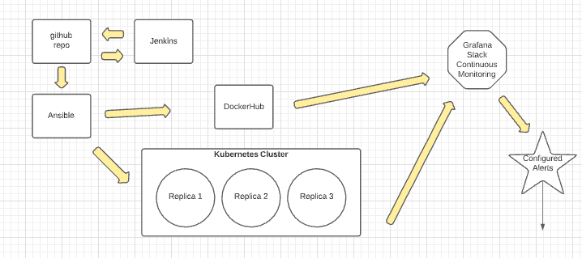
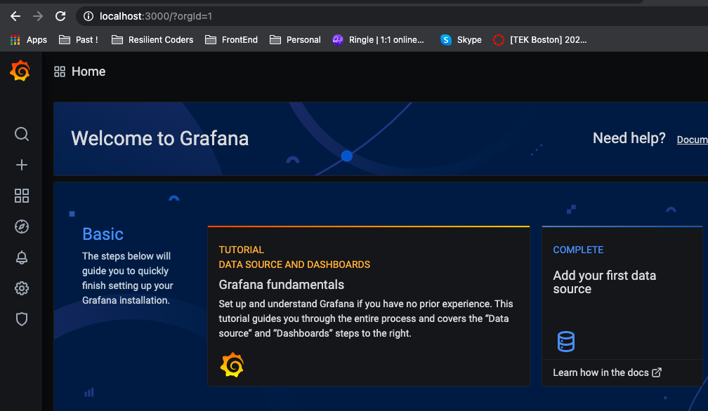

# Capstone Project Part 2

## Components in the Architecture
1. Docker = containerization of the flask application
2. Ansible = deployment of the application via playbook + kubectl
3. Jenkins = CI/CD pipeline through a build script + repo connection
4. Github = to house my repository
5. Kubernetes(minikube) = pods for the application / grafana
6. Grafana = dashboard visualization tool

## LucidChart Diagram

## Deployed!

## Monitoring Process

## Screenshots throughout the Process
### Grafana

Deployment
1. Minikube/Ansible to create Kubernetes Cluster
2. Jenkins to deploy Flask Application into Kubernetes Cluster

Monitoring
1. Grafana Dashboard (CPU, Memory, Disk Utilization and Flask App)
2. htop in a terminal showing utilization of the system.

Stress Testing
1. using stress to simulate application activity.